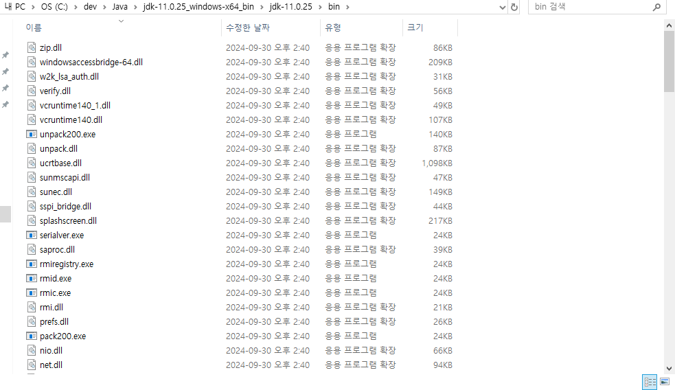

# Java 

## 1. Java 설치
1. Oracle, https://www.oracle.com/kr/java/ 로 접속
2. 헤더 제품 카테고리의 하드웨어 > Java로 이동

3. Java의 버전 확인 후 설치 또는 압축 파일 다운로드 
4. Java 설치
5. Java 설치 후 시스템 환경 변수 수정
- Java 설치 경로 확인 후 경로 복사

- 윈도우의 시스템 환경 변수 프로그램 실행 

- 환경 변수 탭 진입 

- 환경 변수의 path 편집 진입

- path 편집 후 `java설치경로/bin` 경로 추가

- 터미널/cmd 실행 후 `java -version`, `javac -version` 명령어 입력하여 버전 확인


### 2. Java 설치 확인 및 실행 00, HelloWorld
- Java는 `컴파일 언어`로 코드를 새로 작성 또는 수정하였을 경우 compile 후 `.class` 확장자의 실행 파일을 만들어 확인할 수 있다. 

1. HelloWorld.java 파일 생성

2. IDE 또는 text 편집으로 소스 코드 작성
```java
public class HelloWorld {
	public static void main(String[] args) {
		// 이클립스 실행: Ctrl + F11
		/*
		 * 자바 주석 작성 방법
		 */
		System.out.println("한글 확인");
	}
}
```
- Java 출력 메소드
    - System.out.print(); : 줄 바꿈 없이 한 줄에 입력된 값을 모두 출력
    - System.out.println(); : 줄 단위로 입력된 값을 출력
    - System.out.printf(); : 주어진 형식(format)에 맞춰서 입력된 값을 줄 바꿈 없이 출력

3. 코드 소스 파일 컴파일


4. 컴파일 후 실행 파일 확인


5. Java IDE Eclipse에서 컴파일 과정을 알아서 처리해준다.

6. Eclipse 설치 후 Java에서 한글 사용 하기  
- 이클립스 환경 설정 접근

- 환경 설정의 General > Workspace 접근 UTF-8 로 변경

- General > TextEditor > Spelling 탭의 Encoding 값 변경


## 2. Java 기초 정리 01, 


## 3. Java 기초 정리 02, Java 프로그래밍 기본
- Java는 클래스 단위의 객체로 프로그래밍 해야 하고 클래스 내 method를 정의하여 사용할 수 있다.

- main (main method)
```java
public static void main(String[] args) {
  // Java 프로그램에서는 하나의 main method를 포함한 클래스가 반드시 존재해야 함
}
```

- 소스 파일 구성 요소 
```java
package mainpath.path.path; // package 
import java.util.Date; // import 

public class ClassName { // class
  this.var // 
}
```

## 4. Java 기초 정리 03, 변수
- 변수란?
메모리(RAM)에 값을 기록하기 위한 공간, 메모리에 기록이 되어 있어야 데이터를 사용할 수 있다. 

- 변수를 사용하는 이유 
1. 가독성 증가
2. 재사용성 증가
3. 불안정성 감소
4. 코드량 감소로 유지보수 용이 

### 1. Java에서 변수 선언
```java
// 자료형 변수명;
int num;
boolean isTrue;
double pi;
```
Java에서 변수 선언 시 Java에서 제공하는 예약어(키워드)를 통해 자료형을 명시해주어야 한다. 
자료형에 따라 변수에 할당되는 메모리 공간이 다르다.

- 값 대입: 생성된 변수에 값을 대입하는 것 
- 리터럴: 프로그램에서 사용하는 모든 숫자, 문자, 논리값. 변수에 대입되는 `값 자체`, 
```java
// 자료형 변수명 = 리터럴; // <- 값 대입
String name = "name";
char gender = "M";
```

- Java에서 상수 선언
```java
// 자료형을 선언하기 전에 final 키워드를 먼저 선언하여 상수를 선언
final int AGE;
final String BIRTH_DAY = "251027";
```
- 상수의 변수명은 항상 대문자로 작성하고 단어 사이는 `_`로 구분 (snake case 사용)

### 2. 자료형 
1. 논리형, boolean
2. 문자
    - char, `''`안에 작성, 문자형
    - String, 참조형, `""`에 작성, 문자열
3. 숫자, 
    - 정수형: byte/short/int/long
    - 실수형: float/double

### 3. 데이터 저장 단위 
1. bit
    - `데이터의 저장 최소 단위`, 2진수 값 하나를 저장할 수 있다. 
2. byte
    - 8개의 bit로 구성된 단위, `8bit = 1byte`
3. 오버플로우, Overflow
허용된 범위 이상의 비트를 초과하게 되면 최소 값으로 저장되는 현상. 

예) byte의 최대 범위 127에 1을 더하게 되면 -128로 저장된다. 
127byte[= 01111111, ]+ 1 = -128[= 10000000]

### 4. Java Class 
<!-- TODO: 클래스 확인 후 내용 정리 -->
1. Scanner
```java
import java.util.Scanner;
Scanner sc = new Scanner(System.in);

// 정수 형태의 입력 값 받기 
sc.nextInt(); 
// 실수 형 입력 값 받기
sc.nextFloat(); 
sc.nextDouble();
// 문자열 입력 값 받기
sc.next(); // 공백, 줄 구분 입력 불가, 공백까지 구분인자로 판단하여 저장, 줄 구분은 저장하지 않음
sc.nextLine(); // nextLine()은 공백과 줄 구분까지 저장
```

### 5. 형 변환 (Casting)
- 같은 종류 자료형만 대입 -> 같은 종류 자료형만 계산 가능 -> 같은 종류의 자료형 반환이 가능
1. 자동 형변환
- 컴파일러가 `값의 범위가 작은 자료형을 값의 범위가 큰 자료형`으로 자동으로 변환

2. 강제 형변환
- 값의 범위가 큰 자료형을 값의 범위가 작은 자료형으로 변환, 데이터 손실이 발생할 수 있다. 

```java
char ch = 'A';
int chNum = ch; // 강제 형변환 적용
// 65

float f = 1.09f; // 강제 형변환 적용
int num = (int)f;
// 1

double a = 10.0;
float b = (float)a;
```

### 6. 변수와 메모리 구조
1. Static
- Static 예약어로 선정된 필드, 메소드, 클래스 변수 등 저장되는 공간
2. Heap
- 동적 할당 공간, 객체, 배열 등 저장
3. Stack
- 메소드 호출 시 생성되는 공간, 메소드가 끝나면 소멸, 지역 변수, 매개 변수, 메소드 호출 스택 등 저장


